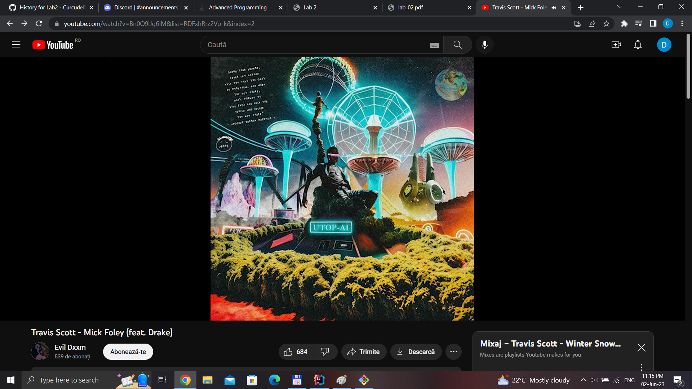

## Laborator 2

### Am rezolvat:

* [x] Compulosory 
* [x] Tema
* [x] Bonus 
* Pentru instante normale: in `RouteFinder.java`, membrul graph trebuie
sa fie de tip `Graph`. Pentru instante mari, generate random, atributul trebuie
sa fie de tip `RandomGraphGenerator`.
* Am adaugat si un video demonstrativ care ilustreaza si cele de mai sus
* Pentru ca algoritmul sa aleaga drumul `Iasi -> Galati -> Tecuci -> OTP`
trebuie comentata linia `pb.addRoad(galatiOtopeni, galati, otopeni);` 
din `Lab2.java` (linia 42). 
* Linie comentata -> Drum rosu
* Linie necomentata -> Drum verde

muzica generata de inteligenta artificiala

